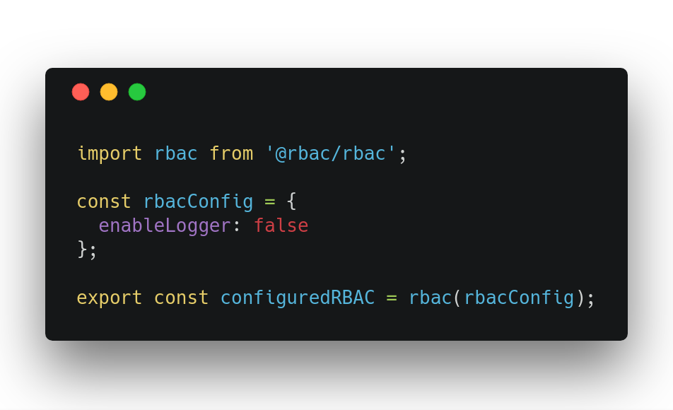
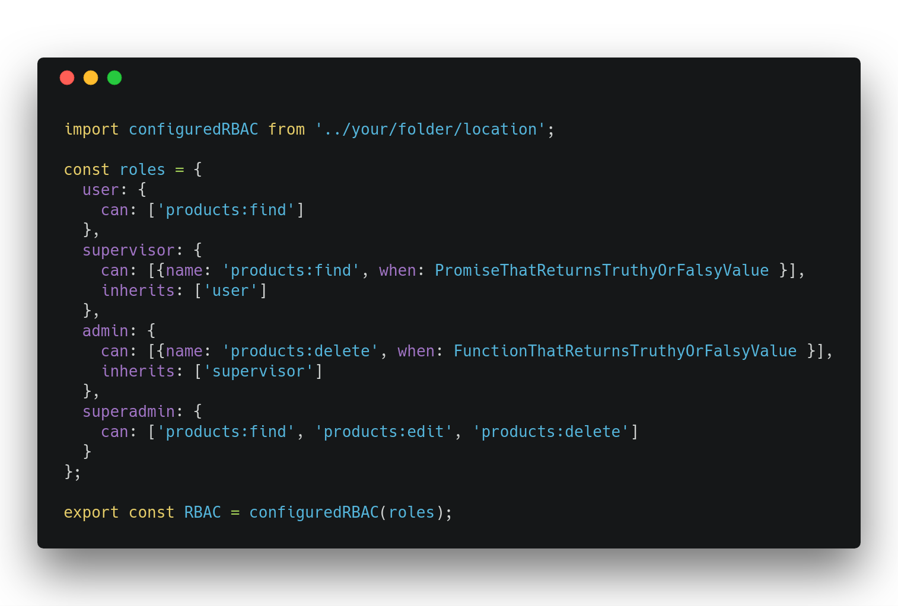
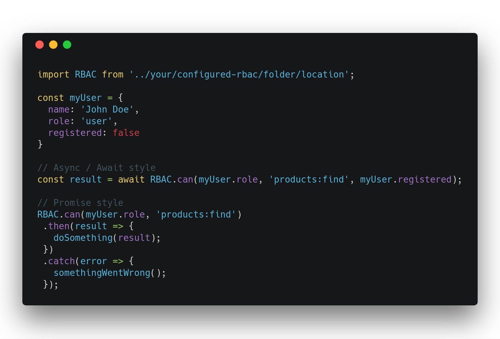

<p align="center">
  
</p>

<h1 align="center">
  Hierarchical Role-Based Access Control for JS
</h1>

## This is a typescript port of [@rbac/rbac](https://www.npmjs.com/package/@rbac/rbac)


[](https://badge.fury.io/js/rbac-ts) 

* ⏱ Lightweight
* 🔥 Blazing Fast
* ⚡️️ Zero dependency

## Features

* Focused on operations
* Scalable
* Each role is given specific access rights for every operation
* High granularity in assigning rights

## Thanks
  Thanks to Karl Düüna ([DeadAlready](https://github.com/DeadAlready)) and his awesome [post on medium](https://blog.nodeswat.com/implement-access-control-in-node-js-8567e7b484d1)
  
  
## Getting Started

#### Install 

pnpm: `pnpm add rbac-ts`
yarn: `yarn add rbac-ts`
npm: `npm i rbac-ts`

RBAC is a curried function thats initially takes an object with configurations, 
then returns another function that takes an object with roles, 
finally returns an object that holds "can" property that is a function.

You can use it in many ways, below is one of them:

#### Setup RBAC config


| Property     	| Type          	| Params                                                      	| Default       	| Description                             	|
|--------------	|---------------	|-------------------------------------------------------------	|---------------	|-----------------------------------------	|
| logger       	| **Function**  	| role: **String**<br/>operation: **String**<br/>result: **Boolean** 	| defaultLogger 	| Function that logs operations to console 	|
| enableLogger 	| **Boolean**   	|                                                             	| true          	| Enable or disable logger                	|

#### Creating some roles


RBAC expects an object with roles as property names.

| Property 	| Type         	| Example                                        	| Description                                                                                                                                                                  	|
|----------	|--------------	|------------------------------------------------	|------------------------------------------------------------------------------------------------------------------------------------------------------------------------------	|
| can      	| **Array**    	            | ```['products:*']```                        	| Array of strings, list of operations that user can do, since 1.1.0 also support glob                                                                                            |
| when     	| **Function or Promise**  	| ```(params , done ) =>  done (null , true )``` 	| **Optional** Promise that should resolve in Truthy or Falsy or  Callback function that receives params and done as properties, should return done passing errors, and result 	|
| inherits 	| **Array**    	            | ```['user']```                                 	| **Optional** Array of strings, list of roles inherited by this role                                                                                                               	|

###### IMPORTANT! **"when"** property should be either a Callback function that receives params and done or a Promise that should resolve in [Truthy](https://developer.mozilla.org/en-US/docs/Glossary/Truthy) or [Falsy](https://developer.mozilla.org/en-US/docs/Glossary/Falsy) values. Example: 

``` javascript 

const roles = {
  supervisor: {
    can: [{ name: 'products:find', when: (params, done) => {
      // done receives error as first argument and Truthy or Falsy value as second argument
      done(error, false);
    }}]
  },
  admin: {
    can: [{name: 'products:*', when: new Promise((resolve) => {
      resolve(true);
    })}]
  }
};

```

#### Check if user can do some operation


| Param  	| Type        	                                 | Example                  	| Description                                                    	|
|--------	|----------------------------------------------- |--------------------------	|----------------------------------------------------------------	|
| First  	| **String**  	                                 | ```'admin'```            	| Array of strings, list of operations that user can do          	|
| Second 	| **String**, **Glob (Wildcard)**, **Regex**     | ```'products:find'```    	| Operation to validate                                          	|
| Third  	| **Any**     	                                 | ```{registered: true}``` 	| **Optional** Params that will flow to "when" callback Function 	|

Want more? Check out the [examples](examples/) folder.

## Roadmap

- [X] Wildcard support
- [X] Regex support
- [ ] Update roles in runtime

## Contributing

#### Contributions are welcome!

1. Build RBAC
  * Run `yarn install` to get RBAC's dependencies
  * Run `yarn build` to produce minified version of RBAC.

2. Development mode
  * Having all the dependencies installed run `yarn dev`. This command will generate a non-minified version of your library and will run a watcher so you get the compilation on file change.

3. Running the tests
  * Run `yarn test` 

4. Scripts
* `yarn build` - produces production version of your library under the `lib` folder
* `yarn dev` - produces development version of your library and runs a watcher
* `yarn test` - well ... it runs the tests :)
* `yarn test:watch` - same as above but in a watch mode

## License

This project is under MIT License [https://opensource.org/licenses/MIT]
